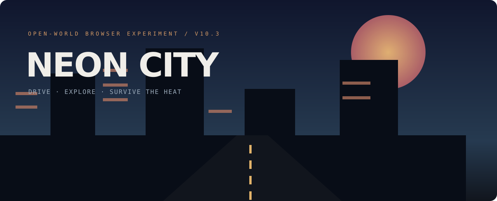

# Neon City

[](https://github.com/thacanadian/Neon-City/actions/workflows/verify.yml)



Neon City is a browser-based open-world action-game experiment built to explore interconnected game systems in plain JavaScript and Three.js.

## Highlights

- On-foot and vehicle movement
- Raycast aiming and five weapon slots
- Grenades, loot drops, health, and armor
- Escalating police heat with police, SWAT, vans, and helicopters
- Missions, cash, skill points, upgrades, and local saves
- Districts, roads, docks, traffic, props, and a minimap
- Tuned cruise-speed movement and reduced early-game spawn pressure

## Run locally

The game uses ES modules and a pinned Three.js CDN dependency, so launch it through a local server:

```bash
python -m http.server 8000
```

Then open `http://localhost:8000`.

Windows users can also run `run_windows.bat`.

## Controls

| Input | Action |
| --- | --- |
| `WASD` | Move or drive |
| Mouse / click | Aim and shoot |
| `E` | Enter or exit vehicle |
| `Shift` | Sprint or nitro |
| `1–5` | Select weapon |
| `Q` / `G` | Select and throw grenade |
| `M` | Start mission |
| `U` | Buy an upgrade |

## Architecture

The build separates missions, weapons, loot, map generation, police heat, grenades, and saves into focused modules under `src/systems`.

## Status

Playable prototype. It is intentionally compact and experimental, not a commercial release.

Built by [Noah Krynicki](https://github.com/thacanadian).
